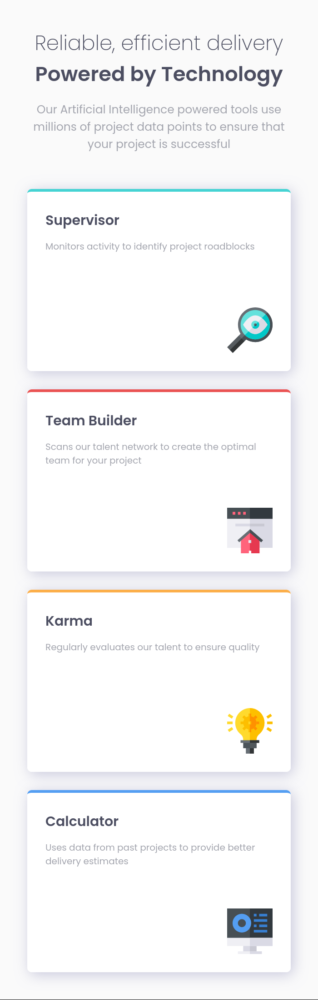
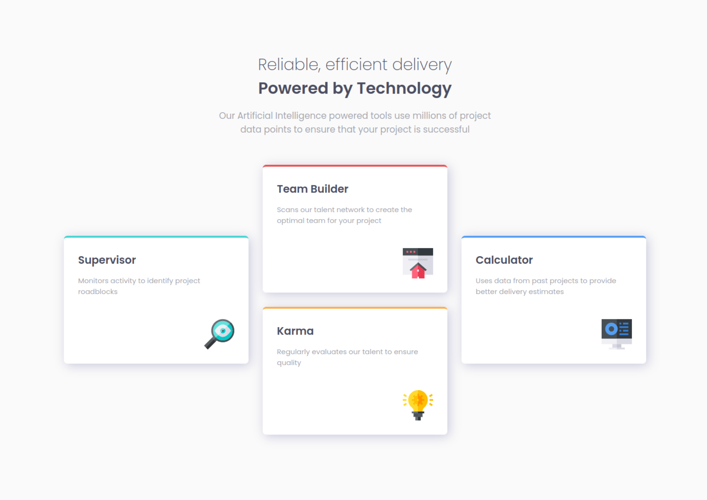

# Frontend Mentor - Four card feature section

This is a solution to the [Four card feature section challenge on Frontend Mentor](https://www.frontendmentor.io/challenges/four-card-feature-section-weK1eFYK). Frontend Mentor challenges help you improve your coding skills by building realistic projects.

### Screenshots

### Links

- Live Site URL: [Github live page](https://h-mihail.github.io/fe-mentor-four-card-feature-section/)
